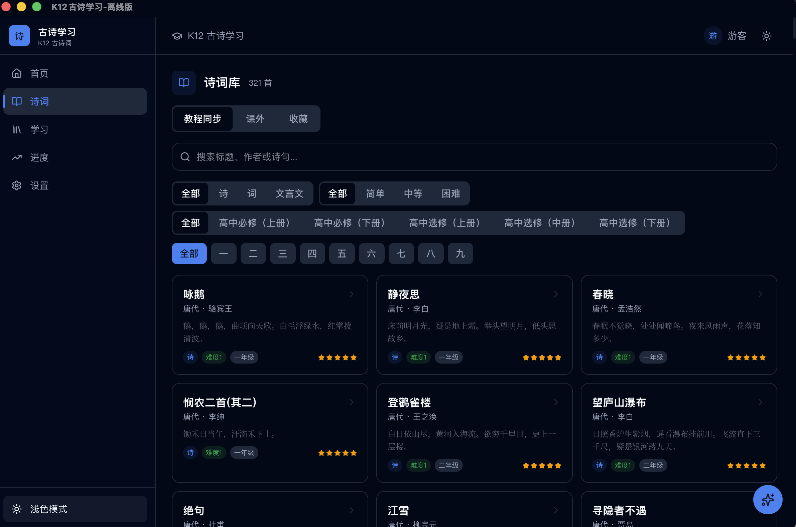
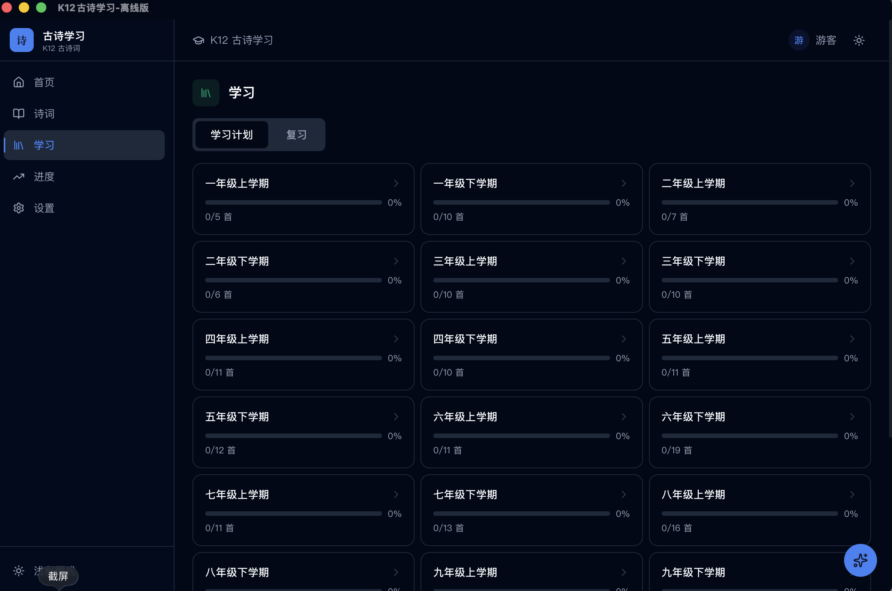
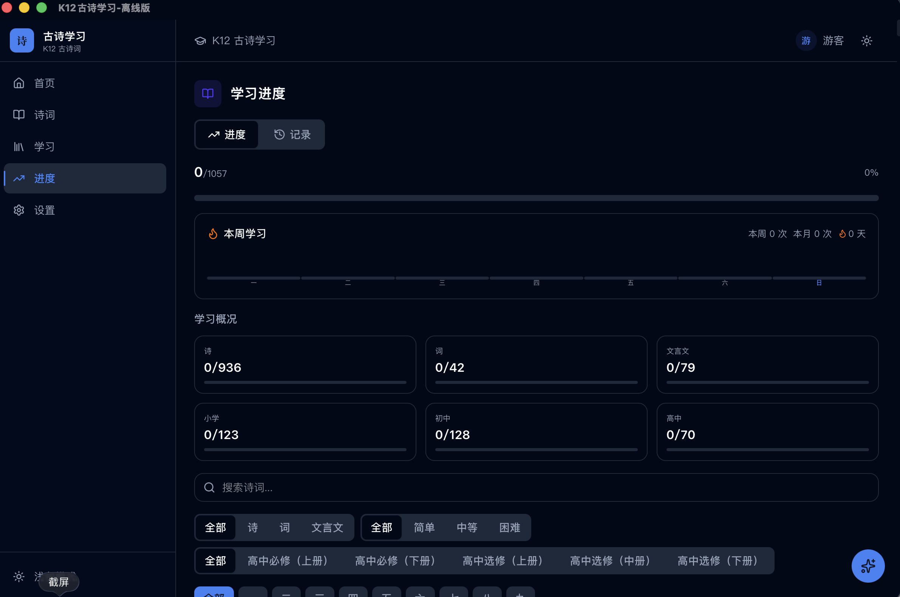
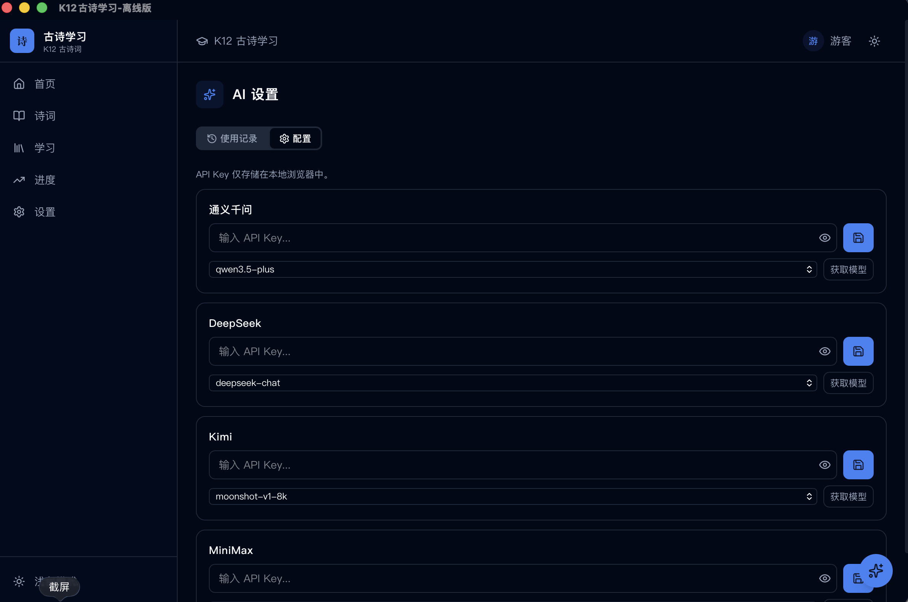
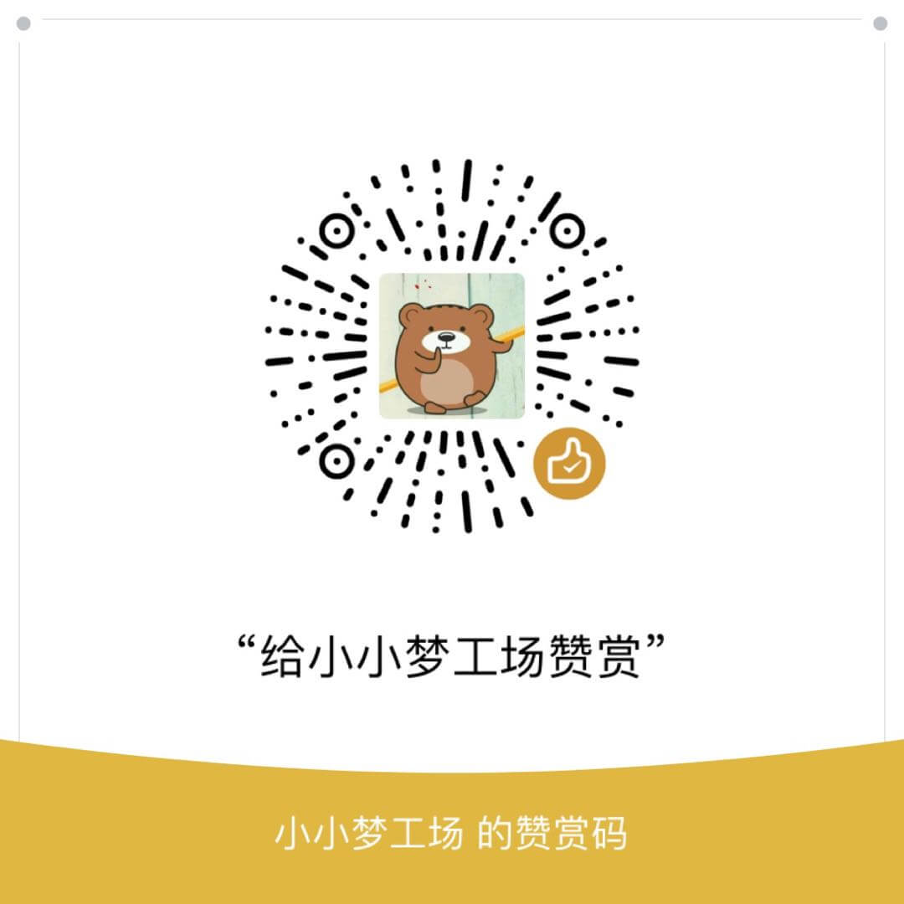

# K12 古诗学习系统

纯前端 K12 古诗学习应用，覆盖 1-12 年级古诗词、文言文及课外经典诗单。支持背诵记忆、知识学习、AI 辅助等完整学习流程。

## 下载

| 平台 | 下载地址 |
|------|----------|
| Web版 | https://k12.xuegushi.com |
| macOS (Apple Silicon) | [下载 .dmg](https://github.com/xuegushi/gushi_k12/releases/tag/v0.1.2) |
| 桌面版 (v0.1.2) | [GitHub Releases](https://github.com/xuegushi/gushi_k12/releases/tag/v0.1.0) |

## 页面预览

| 首页 | 诗词库 |
|------|--------|
|  |  |

| 学习计划 | 学习进度 |
|----------|----------|
|  |  |

| AI 设置 | 设置 |
|---------|------|
|  |  |

## 数据

- **1057 首诗词**（课内 321 首 + 课外 736 首）
- **283 位作者简介**（含生平介绍、代表作品）
- **1441 个 AI 知识点**（K1-9 全覆盖）
- **课外诗单**：唐诗三百首（318首）、宋词三百首（293首）、古诗三百（262首）、古诗十九首（19首）
- 课内诗词含完整译文/注释/赏析/创作背景
- 课外诗词通过 AI 可实时生成译文/注释/赏析
- 数据来源：[学古诗 xuegushi.com](https://xuegushi.com)

## 功能

| 模块 | 说明 |
|------|------|
| 诗词浏览 | 课内按年级/类型/难度筛选，课外按诗单分组，关键词搜索 |
| 诗词详情 | 原文/知识双栏，译文/注释/赏析/创作背景/作者信息/知识点 |
| 拼音标注 | 全文拼音（pinyin-pro），多音字自动识别 |
| 朗读 | Web Speech API 中文朗读 |
| 背诵模式 | 艾宾浩斯遗忘曲线复习（7阶段），挖字辅助记忆（全隐/首字/末字/随机） |
| 学习计划 | 按年级/学期自动生成，勾选完成跟踪进度 |
| AI 助手 | 通义千问 / DeepSeek / Kimi / MiniMax，用户自配 Key |
| AI 生成 | 缺失的译文/注释/赏析可一键 AI 生成 |
| 划词工具 | 选中文字弹出朗读/复制/字典（笔顺动画演示）/AI 分析 |
| 知识点 | AI 生成的问答知识点，支持折叠/展开/筛选 |
| 学习统计 | 按类型/学段统计完成率，周学习柱状图，连续天数，历史记录 |
| 工具箱 | 文言文翻译（AI 双向）、文本朗读（音色/语速/音调可配置）、字迹演练（笔顺动画） |
| 诗词雨 | Canvas 矩阵雨动画，逐列飘落诗句，悬停展示详情 |
| 诗词排序 | 拖拽标点切分的片段，还原诗句顺序 |
| 诗词填空 | 从候选字池选字填入诗句空白处 |
| 飞花令 | 输入包含指定主题字的诗句（8 类 158 个字库） |
| 诗词连连看 | 翻转卡片配对上下句 |
| 诗词拼图 | 点击两个字块交换位置，还原正确字序 |
| 游戏记录 | 所有游戏自动计时、音效、记录保存与查看 |
| 主题 | 5 套配色方案 + 深色/浅色模式 |
| 多用户 | 游客模式 + 创建用户，数据自动继承 |
| AI 调用统计 | 各平台调用次数/tokens/耗时记录 |

## 技术栈

| 类别 | 技术 |
|------|------|
| 框架 | React 19 + TypeScript |
| 构建 | Vite 8 |
| 样式 | Tailwind CSS 4 |
| 状态管理 | Zustand |
| 路由 | React Router v7 |
| 本地存储 | IndexedDB (Dexie.js) |
| 拼音 | cnchar + pinyin-pro |
| 图标 | Lucide React |
| 桌面端 | Tauri v2 |

## 快速开始

```bash
npm install
npm run dev      # http://localhost:5177
npm run build    # 生产构建
npm run preview  # 预览生产版本
```

## 桌面端开发

```bash
npm run tauri:dev    # 启动桌面端开发
npm run tauri:build  # 构建桌面端应用
```

构建产物位于 `src-tauri/target/release/bundle/`

## 项目结构

```
gushi_k12/
├── src/
│   ├── pages/          # 页面组件（Home/PoemList/PoemDetail/StudyPlan/Review/Progress/AiSettings/Tools/PoemRain/PoemSort/PoemFill/PoemChain/PoemMatch/PoemPuzzle/GameRecords等）
│   ├── components/     # 通用组件（Layout/AIAssistant/PoemContent/PinyinText/RecitationDialog/TextSelectionToolbar/RecordsModal等）
│   ├── store/          # Zustand 状态（index/selection/ui/user）
│   ├── lib/            # 工具库（db.ts/ai.ts/poems.ts/recitation.ts/studyPlan.ts/character.ts）
│   ├── hooks/          # 自定义 Hooks
│   ├── data/           # 诗词 JSON 数据 + 课外诗单数据
│   └── index.css       # 全局样式 + 5套配色方案
├── src-tauri/          # Tauri 桌面端配置
│   ├── src/            # Rust 源码
│   ├── icons/          # 应用图标
│   └── tauri.conf.json # Tauri 配置
└── dist/               # Web 构建产物
```

## 支持一下

| 微信赞赏 | 支付宝赞赏 |
|----------|-----------|
|  |  |

| 微信公众号 | 小程序 |
|-----------|--------|
|  |  |

